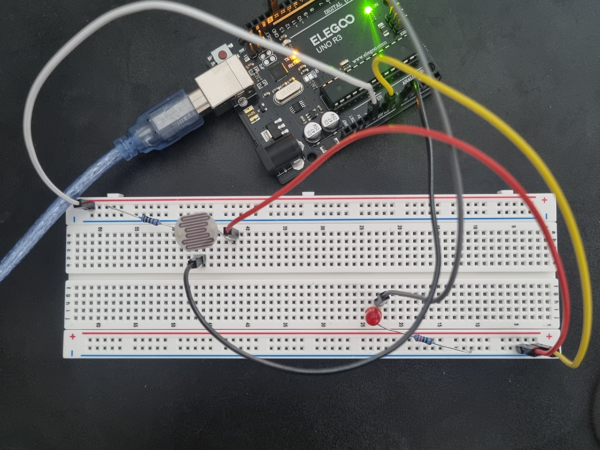
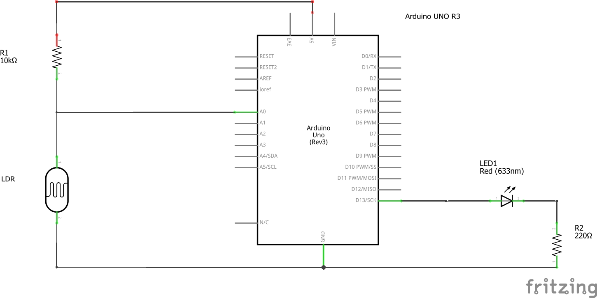

# LDR Light Control

A simple Arduino project that automatically controls an LED based on the ambient light level using a Light Dependent Resistor (LDR).

## Demo

<p align="center">
  
</p>

## Hardware Setup

<p align="center">
  
</p>

## Circuit Diagram

<p align="center">
  
</p>

## Components

* Arduino Uno
* LDR (Light Dependent Resistor)
* 10kΩ Resistor
* LED
* 220Ω Resistor
* Breadboard
* Jumper Wires

## How It Works

The Arduino continuously reads the analog value from the LDR using `analogRead()`.

* If the reading is **greater than or equal to 650**, the environment is considered **dark**, and the LED turns **ON**.
* If the reading is **less than or equal to 230**, the environment is considered **bright**, and the LED turns **OFF**.

Using separate ON and OFF thresholds helps prevent rapid switching when the light level fluctuates around a single threshold.

## Project Structure

```text
01-LDR-Light-Control/
├── images/
│   ├── demo.gif
│   ├── hardware.jpg
│   └── circuit.png
├── ldr_light_control.ino
└── README.md
```

## Future Improvements

* Adjustable threshold using a potentiometer
* PWM brightness control
* Automatic threshold calibration
* LCD status display
