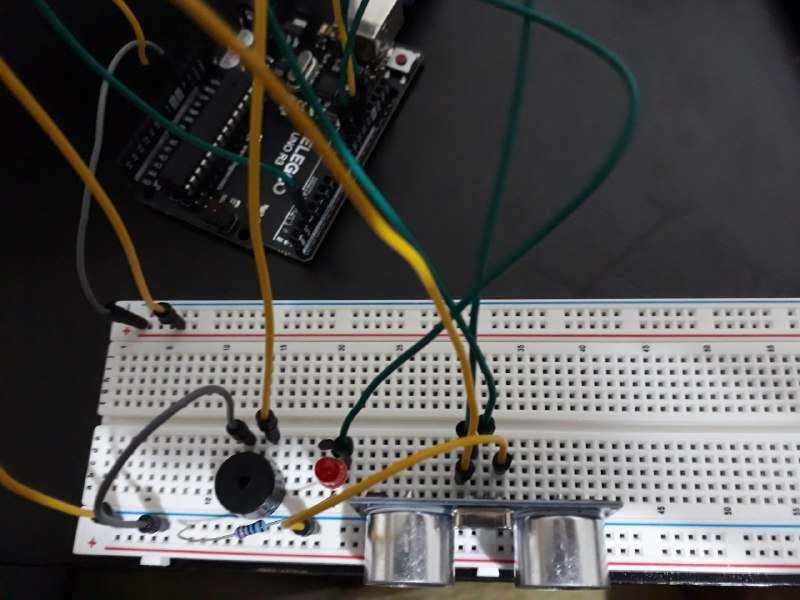
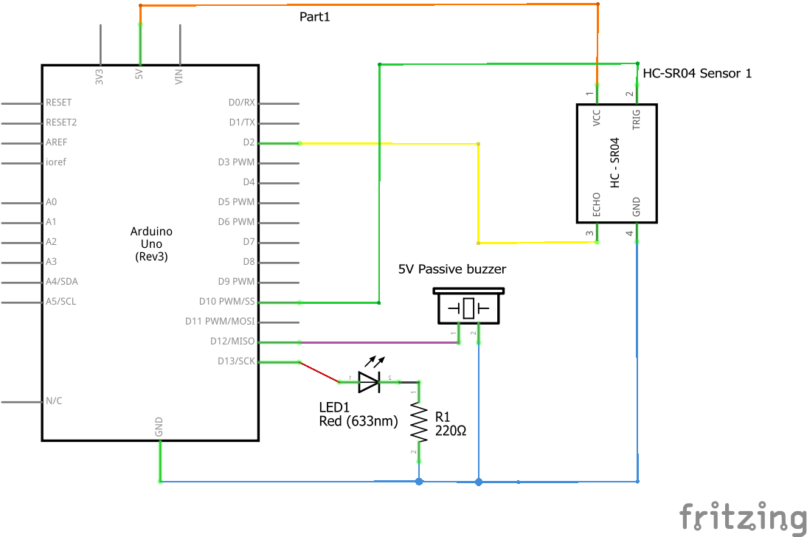

# Ultrasonic Distance Warning System

An Arduino-based distance warning system using the **HC-SR04 ultrasonic sensor**, an **LED**, and a **passive buzzer**.

The system continuously measures the distance to nearby objects and provides different warning patterns based on proximity. As an object gets closer, the warning beeps become faster until they turn into a continuous alarm in the danger zone.

This project also demonstrates the use of **external interrupts** for accurate pulse measurement instead of relying on `pulseIn()`, making the implementation more responsive and non-blocking.

---

## Features

* 📏 Distance measurement using the HC-SR04 ultrasonic sensor
* ⚡ Interrupt-based echo pulse measurement
* 🔊 Variable beep rate based on measured distance
* 🚨 Continuous alarm when an object is very close
* 💡 LED synchronized with the buzzer

---

## Hardware Required

* Arduino Uno (or compatible)
* HC-SR04 Ultrasonic Sensor
* Passive Buzzer
* LED
* 220Ω resistor (for the LED)
* Breadboard
* Jumper wires

---

## Wiring

| Component       | Arduino Pin |
| --------------- | ----------: |
| HC-SR04 Trigger |         D10 |
| HC-SR04 Echo    |          D2 |
| LED             |         D13 |
| Passive Buzzer  |         D12 |

---

## Distance Behavior

| Distance       | Behavior         |
| -------------- | ---------------- |
| **> 40 cm**    | No warning       |
| **25 – 40 cm** | Slow beeps       |
| **15 – 25 cm** | Medium beeps     |
| **8 – 15 cm**  | Fast beeps       |
| **≤ 8 cm**     | Continuous alarm |

---

## Project Structure

```text
02-Ultrasonic-Distance-Warning/
│
├── images/
│   ├── demo.mp4
│   ├── hardware.jpg
│   └── schematic.png
│
├── Ultrasonic_Distance_Warning.ino
└── README.md
```

---

## Demo

https://github.com/your-username/Arduino-Journey/blob/main/02-Ultrasonic-Distance-Warning/images/demo.mp4

> GitHub displays videos directly on the repository page.

---

## Hardware



---

## Schematic



---

## How It Works

1. The Arduino sends a short trigger pulse to the HC-SR04.
2. The sensor returns an echo pulse whose duration is proportional to the measured distance.
3. An external interrupt records the pulse width with microsecond precision.
4. The pulse duration is converted into distance.
5. According to the measured distance:

   * No warning is generated when the object is far away.
   * The LED and buzzer beep periodically as the object approaches.
   * The beep interval decreases as the distance gets smaller.
   * A continuous alarm is activated inside the danger zone.
6. If no valid measurement is received within the timeout period, the warning is automatically disabled.

---

## Concepts Demonstrated

* Arduino external interrupts (`attachInterrupt`)
* Interrupt Service Routines (ISR)
* Direct Port Manipulation (`PIND`)
* Non-blocking timing using `millis()`
* Distance calculation from ultrasonic pulse duration
* State-machine style output control
* Sensor timeout handling
* Basic signal filtering

---

## Future Improvements

* Adjustable distance thresholds using a potentiometer
* OLED or LCD distance display
* RGB LED status indicator
* Battery-powered portable version
* Automatic buzzer volume control
* Object detection averaging/filtering
* FreeRTOS-based implementation for advanced scheduling
